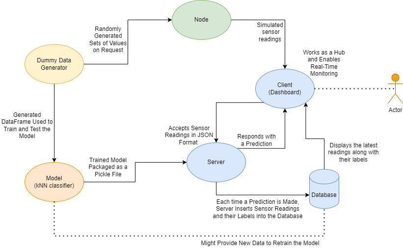

# Anomaly Detection System

## Aim
The project aims at developing a simple anomaly detection system for a wind turbines manufacturer.
The parameters of interests are pre-selected by workfloor employees with vast domain knowledge.

The project facilitates development of a machnie learning model (kNN classifier), and implementing it in such a way, 
that it can digest incoming live-data stream to provide instant predictions to spot anomalies on the fly, potentially 
letting the company to save up considerable amounts of money due to avoiding downtimes and producing defective products.

## Implementation
   
The project consists of three main components, namely: server, dashboard, and node.
### Server
Server uses the pre-trained model loaded from a file, processes incoming data and returns predictions, as well as stores 
both the data and predicted labels in the SQLite3 database.
### Dashboard
The `streamlit` dahsboard acts like a hub, accepting the data from the node and forwards them to the server.
It displays real-time graphs and notifications on spotted anomalies. It also displays a set number of recent anomalies 
fetched from the database.
### Node
It simulates the sensor readings in the production environment. A new set of sensor readings is being generated every second, 
and sent to the Dashboard, mimicking the live stream of data.

## Data 
All the data used in the project is generated by `data_generator.py` script, and it follows Gaussian distribution. 
For model training purposes, a `*.csv` file with a 1000 records was generated, where all the data from outside 3 standard deviations
from the mean were labeled as anomalous. 

# Run

## Run these commands in the terminal (requires 3 instances of terminal running)

### Open new terminal and run the command
`uvicorn server:app --reload --port 8000`

### Open new terminal and run the command
`uvicorn node:app --reload --port 8001`

### Open new terminal and run the command
`streamlit run Dashboard.py`

## To stop:
### Go to each terminal and hit `Ctrl + C`

